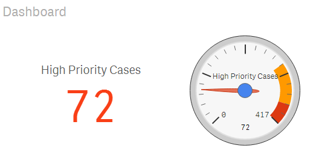

# Google Gauge Chart extension for Qlik Sense
Animated Google Gauge Chart extension for Qlik Sense as found at
[https://developers.google.com/chart/interactive/docs/gallery/gauge](https://developers.google.com/chart/interactive/docs/gallery/gauge)


## Installation
- [Download zip file](https://github.com/yianni-ververis/google-gauge/archive/master.zip)
- Desktop - Unzip at the extension folder (C:\Users\<user>\Documents\Qlik\Sense\Extensions\GoogleGaugeChart) 
- Server - Upload the zip file


## Usage

##### Dimensions and Measures
- add 2 measures with this order
  1. Display Number,
  2. Total


##### Extension Settings
- Coming up!

##### Example (Helpdesk)

```

"High Priority Cases"
Count( {$<Priority={'High'}, Status -={'Closed'} >} Distinct %CaseId )

"Total Closed Cases"
Count( {$<Status -={'Closed'} >} Distinct %CaseId )

```




---

[Download zip file](https://github.com/yianni-ververis/google-gauge/archive/master.zip)